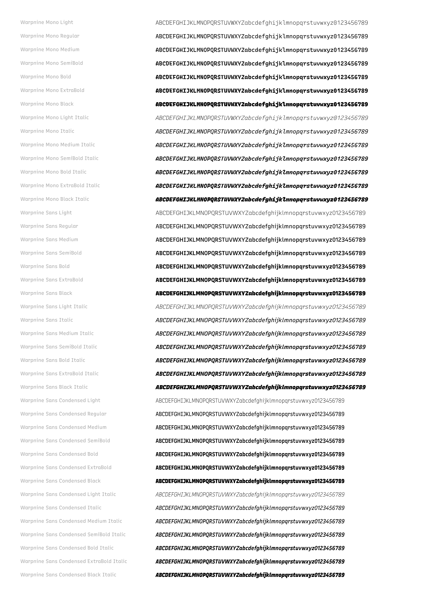
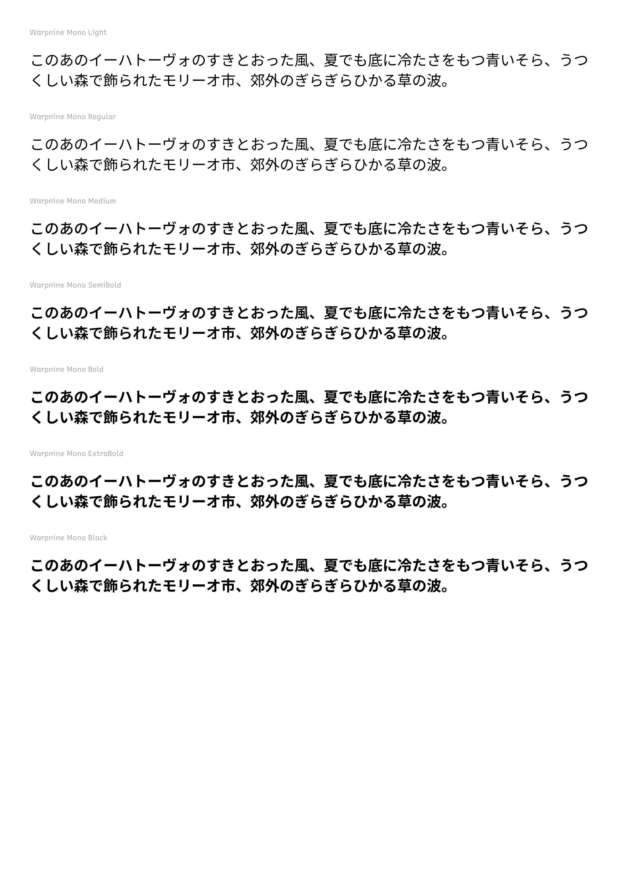

# Warpnine Fonts

Custom fonts based on [Recursive](https://github.com/arrowtype/recursive) [1.085](https://github.com/arrowtype/recursive/releases/tag/v1.085), [JetBrains Mono](https://github.com/JetBrains/JetBrainsMono) [2.304](https://github.com/JetBrains/JetBrainsMono/releases/tag/v2.304), and [Noto Sans Mono CJK JP](https://github.com/notofonts/noto-cjk) [`f8d15753`](https://github.com/notofonts/noto-cjk/tree/f8d157532fbfaeda587e826d4cd5b21a49186f7c).

- **WarpnineMono**: Monospace font using Recursive Mono Duotone (Linear for Light/Regular, Casual for Medium+) with JetBrains Mono box drawing characters and Noto CJK for Japanese characters.
- **WarpnineSans**: Proportional sans-serif using Recursive Sans Linear (Latin only).
- **WarpnineSansCondensed**: Condensed variant of WarpnineSans (90% width, Latin only).

[](docs/sample.pdf)
[](docs/sample.pdf)

## Download

Pre-built fonts are available from [GitHub Releases](https://github.com/0x6b/warpnine-fonts/releases). Each release includes:

- Variable Font: `WarpnineMono-VF.ttf` (recommended)
- Static Fonts: Light through ExtraBlack, upright and italic
- Sans Fonts: `WarpnineSans-VF.ttf` (variable) and `WarpnineSans-*.ttf` (static, proportional sans-serif, Latin only)
- Condensed Fonts: `WarpnineSansCondensed-VF.ttf` (variable) and `WarpnineSansCondensed-*.ttf` (static, proportional sans-serif, 90% width, Latin only)
- License file: `OFL`

Releases are automatically built and published via GitHub Actions when a tag matching the pattern `v[YYYY-MM-DD]`, `[YYYY-MM-DD]`, or with patch suffix (e.g. `v2025-01-15.1`) is pushed, or manually triggered.

## Features

- Variable Fonts with 2 axes (`wght`, `ital`):
  - WarpnineMono: `wght` 300 (Light) to 1000 (ExtraBlack), `ital` 0 (Upright) to 1 (Italic)
  - WarpnineSans / WarpnineSansCondensed: `wght` 300 (Light) to 900 (Black), `ital` 0 (Upright) to 1 (Italic)
- Programming Ligatures: `->`, `=>`, `>=`, `!=`, `===`, `&&`, `||`, and more (delivered via the `dlig` feature; most editors/terminals leave `dlig` off by default — see [Enabling Ligatures](#enabling-ligatures))
- Frozen OpenType Features (always active, baked into the default cmap):
  - `pnum`
  - `ss01` through `ss08`, `ss10`, `ss11`, `ss12`
  - See [OpenType Features](#opentype-features) for details
- Runtime OpenType Features (require application opt-in):
  - `dlig` (programming ligatures), `liga` (`fi`, `ffi`)
- Box Drawing: Full-height box drawing characters (U+2500-U+257F) from JetBrains Mono for seamless terminal UI
- CJK Support: 32,042 mapped Unicode codepoints in the Mono VF, including 93 Hiragana, 96 Katakana, 20,976 CJK Unified Ideographs, and 6,582 CJK Extension A ideographs
- CJK Weight Range: Japanese glyphs interpolate across wght 400-700 (Noto CJK source range); Light=Regular and ExtraBold/Black/ExtraBlack=Bold for CJK shapes
- Static Fonts: Light through ExtraBlack, both upright and italic
- Mixed CASL Style: Light/Regular use Linear (traditional), Medium+ use Casual (rounder)

## Requirements

- Rust 1.85+ (2024 edition)
- [uv](https://docs.astral.sh/uv/) for Python font-output validation (`uv run pytest tests/ -v`); not required for building fonts
- [Typst](https://typst.app/) on `PATH` when using `dev generate-sample` (`brew install typst` on macOS)

## Build

```console
$ cargo build --release
$ ./target/release/warpnine-fonts build --version 2026-07-11
```

That will generate the following fonts:

- Variable font: `dist/WarpnineMono-VF.ttf` (31 MB)
- Static fonts: `dist/WarpnineMono-*.ttf` (18 MB each)
  - Light, Regular, Medium, SemiBold, Bold, ExtraBold, Black, ExtraBlack
  - Each with upright and italic variants
- Sans variable font: `dist/WarpnineSans-VF.ttf`
- Sans static fonts: `dist/WarpnineSans-*.ttf`
  - Light, Regular, Medium, SemiBold, Bold, ExtraBold, Black
  - Each with upright and italic variants
- Condensed variable font: `dist/WarpnineSansCondensed-VF.ttf`
- Condensed static fonts: `dist/WarpnineSansCondensed-*.ttf`
  - Light, Regular, Medium, SemiBold, Bold, ExtraBold, Black
  - Each with upright and italic variants

### Other Commands

```console
$ ./target/release/warpnine-fonts build-mono --version 2026-07-11       # WarpnineMono only
$ ./target/release/warpnine-fonts build-sans --version 2026-07-11       # WarpnineSans only
$ ./target/release/warpnine-fonts build-condensed --version 2026-07-11  # Condensed only
$ ./target/release/warpnine-fonts download         # download source fonts only
$ ./target/release/warpnine-fonts clean            # remove build artifacts
$ ./target/release/warpnine-fonts dev              # hidden commands for development
$ ./target/release/warpnine-fonts --help           # list all commands
```

## Technical Details

### Font Axes

- wght (Weight): 300-1000
  - 300: Light, 400: Regular, 500: Medium, 600: SemiBold
  - 700: Bold, 800: ExtraBold, 900: Black, 1000: ExtraBlack
- ital (Italic): 0-1
  - 0: Upright, 1: Italic

### Variable Font Tables

The variable font includes:

- **fvar**: Axis definitions and 16 named instances
- **gvar**: Glyph variation data with IUP optimization
- **STAT**: Style Attributes table for proper font menu grouping
  - Weight axis values with "Regular" as elidable default
  - Italic axis values with "Upright" as elidable default

Note: The following tables are intentionally excluded:

- **HVAR/MVAR**: For a monospace font with fixed advance widths, HVAR provides minimal benefit. MVAR is optional and omitted for simplicity.
- **vhea/vmtx**: Vertical metrics tables are excluded due to browser compatibility issues (OTS validation errors in Chrome/Firefox). This means vertical text layout (`writing-mode: vertical-rl`) is not supported.

### OpenType Features

See [arrowtype/recursive-code-config](https://github.com/arrowtype/recursive-code-config) for detail of the each feature.

"Frozen" features have their substitutions baked into the default cmap — they are always active and cannot be disabled. This works for single-glyph substitutions only (e.g. stylistic sets, proportional figures). Multi-glyph features such as `dlig` and `liga` are kept as standard runtime GSUB lookups; they fire only when the rendering application enables the feature.

#### WarpnineMono

Frozen at build (always active):

- `pnum`: Proportional figures
- `ss01`: Single-story a
- `ss02`: Single-story g
- `ss03`: Simplified f
- `ss04`: Simplified i
- `ss05`: Simplified l
- `ss06`: Simplified r
- `ss07`: Serifless I
- `ss08`: Serifless L and Z
- `ss10`: Dotted 0
- `ss11`: Simplified 1
- `ss12`: Simplified @

Runtime (require app opt-in):

- `dlig`: Discretionary ligatures (programming ligatures: `->`, `=>`, `>=`, `!=`, `===`, etc.)
- `liga`: Standard ligatures (`fi`, `ffi`)

#### WarpnineSans and WarpnineSansCondensed

Frozen at build (always active):

- `ss01`: Single-story a
- `ss02`: Single-story g
- `ss03`: Simplified f
- `ss04`: Simplified i
- `ss05`: Simplified l
- `ss06`: Simplified r
- `ss07`: Serifless I
- `ss08`: Serifless L and Z
- `ss12`: Simplified @
- `case`: Case-sensitive forms
- `pnum`: Proportional figures

Runtime (require app opt-in):

- `liga`: Standard ligatures (`fi`, `ffi`)

#### Additional Features (Variable Font)

The variable font retains additional OpenType features from Recursive:

- Stylistic Sets: `ss09`, `ss20`
- Other: `zero`, `frac`, `locl`, `calt`, and more

### Enabling Ligatures

Programming ligatures live in the `dlig` feature. Most editors and terminals enable `liga` and `calt` by default but leave `dlig` off, so you must opt in.

#### Ghostty (`~/.config/ghostty/config`):

```
font-family = "Warpnine Mono"
font-feature = dlig
```

#### Zed (`~/.config/zed/settings.json`):

```json
{
  "buffer_font_family": "Warpnine Mono",
  "buffer_font_features": {
    "calt": true,
    "liga": true,
    "dlig": true
  }
}
```

#### CSS:

```css
font-feature-settings: "dlig", "liga", "calt";
```

## Known Limitations

### No Vertical Text Support

The variable font does not support vertical text layout (CSS `writing-mode: vertical-rl`). The vertical metrics tables (vhea/vmtx) are excluded due to OTS validation issues in browsers. Static fonts retain vertical metrics if present in the source fonts.

### Typst: ExtraBlack Weight Not Accessible

[Typst](https://typst.app/) caps font weights at 900, so ExtraBlack (weight 1000) cannot be selected via the `weight` parameter. Both Black (900) and ExtraBlack (1000) will render as Black when using:

```typ
#text(font: "Warpnine Mono", weight: 900)[This renders as Black]
```

The fonts are correctly built per OpenType spec; this is a Typst limitation.

## Testing

Validation tests use Python with fonttools:

```console
$ uv run pytest tests/ -v
```

## License

- The build tools and source code are licensed under the MIT. See [License](./LICENSE).
- The fonts are licensed under the SIL Open Font License. See [OFL](./OFL) for detail. This project combines fonts with the following licenses:
  - Recursive Mono: [SIL Open Font License](https://raw.githubusercontent.com/arrowtype/recursive/refs/tags/v1.085/OFL.txt)
  - JetBrains Mono: [SIL Open Font License](https://raw.githubusercontent.com/JetBrains/JetBrainsMono/v2.304/OFL.txt)
  - Noto Sans Mono CJK JP: [SIL Open Font License](https://raw.githubusercontent.com/notofonts/noto-cjk/f8d157532fbfaeda587e826d4cd5b21a49186f7c/Sans/LICENSE)
- The sample text in the [PDF](docs/sample.pdf) is an excerpt from "[Mathematical Games](https://www.scientificamerican.com/article/mathematical-games-1970-10/)" by Martin Gardner, published in _Scientific American_ Vol. 223 No. 4 (October 1970), p. 120. [doi:10.1038/scientificamerican1070-120](https://doi.org/10.1038/scientificamerican1070-120)
